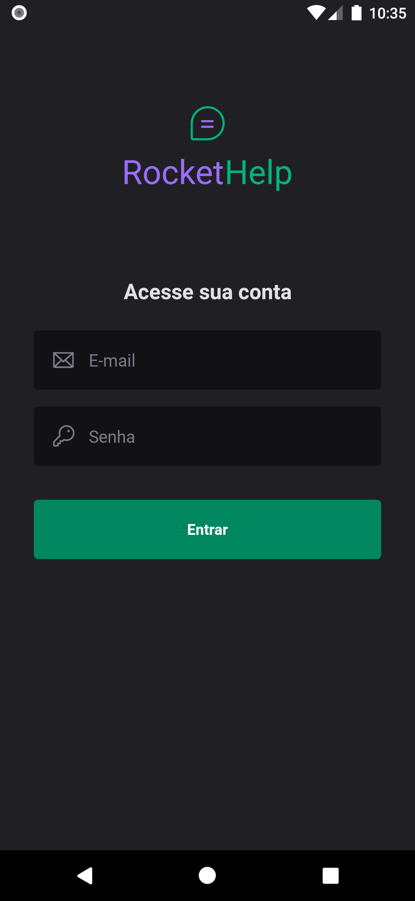
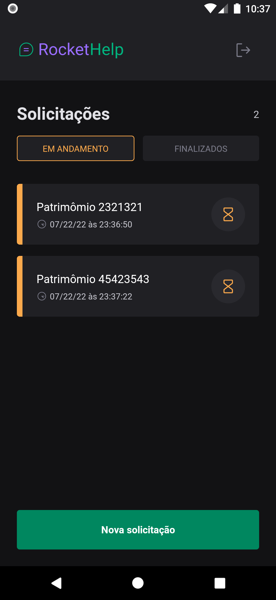
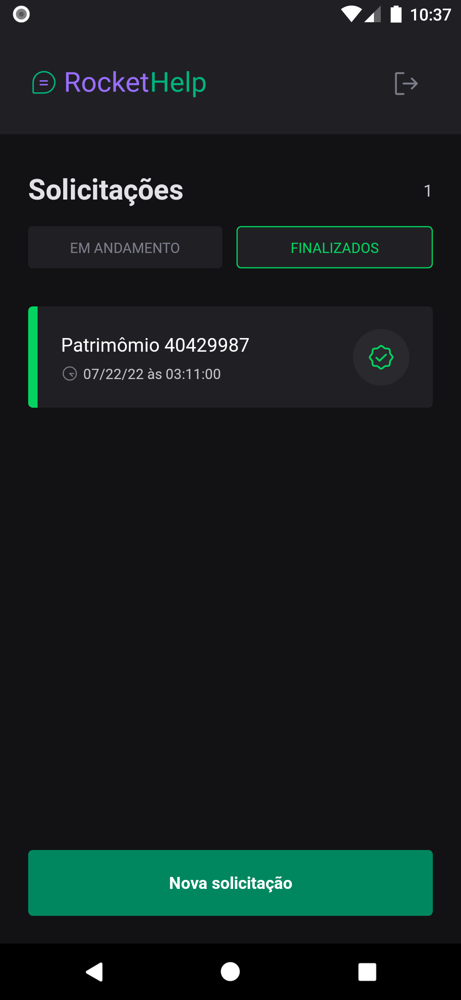
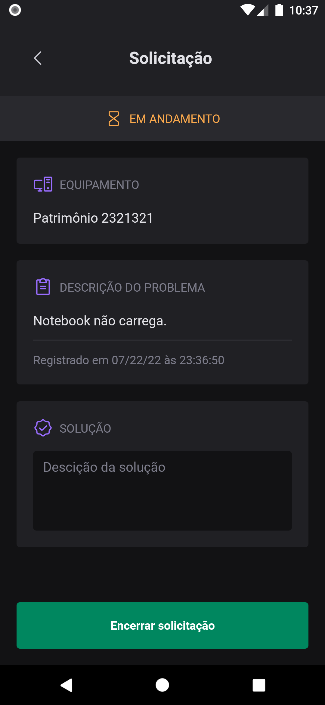
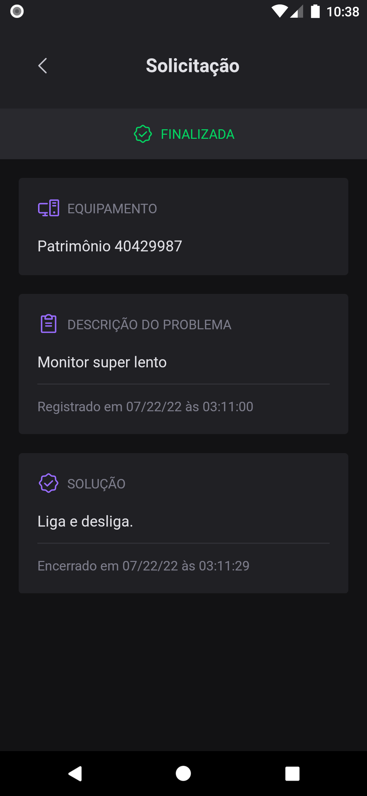

<h1 align="center">Rocket Help</h1>

<p align="center">
  
  
  <a href="https://github.com/jtiagosantos/rocket-help/commits/master">
    
  </a>
  
   <a href="https://github.com/jtiagosantos/rocket-help/stargazers">
    
  </a>
</p>

<h4 align="center"> 
	🚧  Rocket Help 📝 Completed 🚀 🚧
</h4>

<p align="center">
  <a href="#-features">Features</a> •
  <a href="#-run-project">Run Project</a> • 
  <a href="#-technologies">Technologies</a> • 
  <a href="#-layout">Layout</a> •
  <a href="#-author">Author</a> • 
  <a href="#-license">License</a>
</p>

<br>

<h1 align="center">
  
  
  
  
  
</h1>

<hr />

## ⚙️ Features

- [x] Sign In
- [x] Add new request
- [x] Filter requests by pending/finished 
- [x] Close request with a solution 
- [x] See details of a closed details

<hr>

## 🚀 Run Project

1️⃣ Clone project and access its folder:

```bash
$ git clone https://github.com/jtiagosantos/rocket-help.git
$ cd rocket-help
```

2️⃣ Install dependencies:

```bash
$ yarn or npm i
```

3️⃣ Start project:

```bash
//android
$ yarn android or npm run android

//ios
$ yarn ios or npm run ios
```

🔐 Test data

E-mail: teste@email.com

Senha: 12345678

<hr>

## 🛠 Technologies

The following tools were used in the construction of project:

- **[Expo](https://docs.expo.dev/)**
- **[Native Base](https://docs.nativebase.io/?utm_source=HomePage&utm_medium=header&utm_campaign=NativeBase_3)**
- **[Typescript](https://www.typescriptlang.org/)**
- **[ESLint](https://eslint.org/)**
- **[Prettier](https://prettier.io/)**

<hr>

## 🔖 Layout

You can view the project layout through the link below:

- **[Layout](https://www.figma.com/file/mHEfhu0SMSjVbz5bedd5OQ/Ignite-Lab-de-React-Native-20k22-(Copy)?node-id=37%3A6)**

<hr>

## 👨‍💻 Author


<strong><a href="https://github.com/jtiagosantos">Tiago Santos </a>🚀</strong>

[](https://www.linkedin.com/in/josetiagosantosdelima/)
[](mailto:tiago.santos@icomp.ufam.edu.br)

<hr>

## 📝 License

This project is under license [MIT](./LICENSE).
